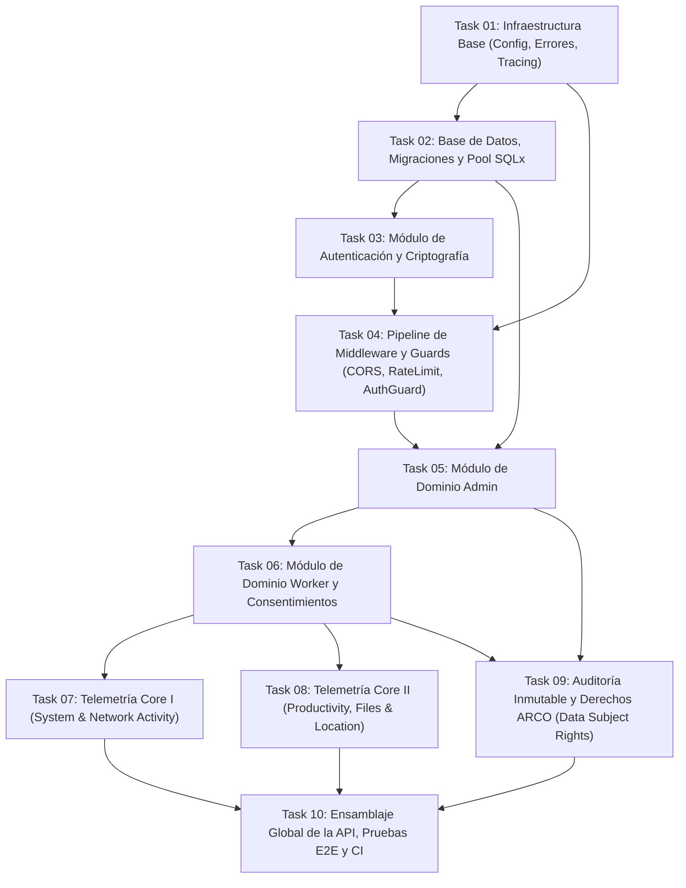

# Plan de Implementación — Telemetry API (Tasks Roadmap)

Bienvenido a la guía maestra de tareas para la construcción de la **Telemetry API**. Esta API está construida en **Rust (Axum 0.7 + Tokio + SQLx + PostgreSQL 16)** bajo una arquitectura de **Monolito Modular** y un modelo de seguridad estricto de **Conocimiento Cero (Zero-Knowledge)**.

---

## 1. Principios de Arquitectura y Gobernanza

1. **Zero-Knowledge Server:** El servidor actúa como intermediario cifrado y almacenamiento persistente. **NUNCA** posee las claves de cifrado ni descifra payloads de telemetría. Todos los payloads de telemetría son blobs binarios opacos (`BYTEA`).
2. **Organización Modular:** Estructurado por dominios (`admin`, `worker`, `telemetry`, `auth`) con infraestructura compartida (`config`, `database`, `errors`, `middleware`, `models`). Cada módulo posee su propio `models.rs`, `handlers.rs`, `routes.rs` y `mod.rs`.
3. **Manejo Estricto de Errores:** Prohibido el uso de `.unwrap()` y `.expect()` en código de producción. Todos los errores usan `thiserror` con propagación `?` y se unifican en un `AppError` que implementa `IntoResponse` con un formato JSON canónico:
   ```json
   {
     "error": {
       "code": "ERROR_CODE",
       "message": "Human readable explanation",
       "details": null
     }
   }
   ```
4. **Verificación en Tiempo de Compilación:** Todas las consultas SQL en handlers deben utilizar las macros de SQLx (`sqlx::query!`, `sqlx::query_as!`), garantizando compatibilidad de esquema en compilación.
5. **Trazabilidad y Privacidad:** Uso exclusivo de `tracing` para logs estructurados. Queda terminantemente prohibido loguear contraseñas, tokens JWT o contenido de payloads cifrados.
6. **Políticas de Privacidad y Cumplimiento Legal (Chile / Ley 19.628 y GDPR):**
   - Telemetría de pulsaciones de teclas: **frecuencia solamente**, nunca contenido (no es un keylogger).
   - Telemetría web: **dominio / URL solamente**, nunca contenido de la página.
   - Capturas de pantalla: requieren bandera de consentimiento explícito e independiente (`productivity_screenshots`).
   - Telemetría de ubicación: restringida a trabajadores con rol `FIELD`, dentro de su horario laboral y con consentimiento explícito.

---

## 2. Matriz de Dependencia y Secuencia de Ejecución



---

## 3. Resumen de Tareas

| ID | Archivo | Módulo / Componente | Descripción Principal | Estado |
|:---|:---|:---|:---|:---:|
| **01** | [`task-01-foundations-config-errors.md`](file:///Users/demian/Documents/GitHub/telemetry-api/tasks/task-01-foundations-config-errors.md) | `config`, `errors`, `models` | Carga de variables de entorno, configuración tipada, jerarquía de errores centralizados `AppError`, respuestas JSON normalizadas y logging con `tracing`. | 🟢 Completada |
| **02** | [`task-02-database-migrations-and-pooling.md`](file:///Users/demian/Documents/GitHub/telemetry-api/tasks/task-02-database-migrations-and-pooling.md) | `database`, `migrations` | Configuración de pool SQLx, migraciones DDL completas con UUIDv7, índices optimizados, triggers `updated_at` y constraints de privacidad. | 🟢 Completada |
| **03** | [`task-03-authentication-and-crypto.md`](file:///Users/demian/Documents/GitHub/telemetry-api/tasks/task-03-authentication-and-crypto.md) | `auth`, `crypto` | Registro/login, hashing con Argon2/Bcrypt, generación de JWTs (HS256), rotación de refresh tokens y detección de reuso de familias de tokens. | 🟢 Completada |
| **04** | [`task-04-middleware-pipeline-and-guards.md`](file:///Users/demian/Documents/GitHub/telemetry-api/tasks/task-04-middleware-pipeline-and-guards.md) | `middleware` | Sanitización de logs en TraceLayer, CORS, límite de payload (10MB), Rate Limiting en memoria y extractores de autenticación/roles (`AuthUser`, `RequireAdmin`, `RequireWorker`). | 🟢 Completada |
| **05** | [`task-05-admin-domain-module.md`](file:///Users/demian/Documents/GitHub/telemetry-api/tasks/task-05-admin-domain-module.md) | `admin` | Endpoints `GET /admins/me` y `PUT /admins/me`, métricas agregadas de trabajadores a cargo y eventos de auditoría administrativa. | 🟢 Completada |
| **06** | [`task-06-worker-domain-module.md`](file:///Users/demian/Documents/GitHub/telemetry-api/tasks/task-06-worker-domain-module.md) | `worker` | Gestión completa de trabajadores (CRUD), asignación a admins, validación de horario de trabajo, filtro por rol (`OFFICE` vs `FIELD`) y actualización de banderas de consentimiento. | 🟢 Completada |
| **07** | [`task-07-telemetry-ingestion-system-network.md`](file:///Users/demian/Documents/GitHub/telemetry-api/tasks/task-07-telemetry-ingestion-system-network.md) | `telemetry` (System & Network) | Ingesta batch (máx 100 registros), validación de derivación de timestamp, almacenamiento directo `BYTEA` sin descifrado, recuperación paginada con filtrado temporal y verificación de pertenencia admin-worker. | 🟢 Completada |
| **08** | [`task-08-telemetry-productivity-files-location.md`](file:///Users/demian/Documents/GitHub/telemetry-api/tasks/task-08-telemetry-productivity-files-location.md) | `telemetry` (Productivity, Files, Location) | Ingesta de métricas de productividad (BASIC vs SCREENSHOT), archivos corporativos y coordenadas GPS con validación estricta de consentimiento, rol `FIELD` y ventana horaria activa. | 🟢 Completada |
| **09** | [`task-09-audit-logging-and-data-subject-rights.md`](file:///Users/demian/Documents/GitHub/telemetry-api/tasks/task-09-audit-logging-and-data-subject-rights.md) | `audit`, `worker` (DSR) | Registro de auditoría inmutable en `audit_logs`, endpoints de derechos de titulares de datos: exportación (`/data-request`) y eliminación/olvido (`/data-deletion`). | 🟢 Completada |
| **10** | [`task-10-application-assembly-and-e2e-testing.md`](file:///Users/demian/Documents/GitHub/telemetry-api/tasks/task-10-application-assembly-and-e2e-testing.md) | `main`, `routes`, `tests/` | Ensamblaje del enrutador central, endpoint `/health`, graceful shutdown con señales del SO, suite de pruebas de integración de extremo a extremo y validación estricta en CI (`clippy`, `rustfmt`). | 🟢 Completada |

---

## 4. Convenciones de Desarrollo y Definición de Terminado (DoD)

Para que cualquier tarea se considere terminada (`DONE`), debe cumplir sin excepción:
1. **Compilación Limpia:** `cargo check` y `cargo test` deben compilar sin advertencias.
2. **Cero Lints de Clippy:** `cargo clippy -- -D warnings` debe finalizar exitosamente con código de salida 0.
3. **Formateo Estricto:** `cargo fmt --check` debe validar todas las reglas de estilo de Rust.
4. **Pruebas Automatizadas:**
   - Pruebas unitarias en el módulo correspondiente bajo `#[cfg(test)]`.
   - Nomenclatura de pruebas: `test_<modulo>_<accion>_<condicion>_<resultado_esperado>`.
5. **Documentación de Código:** Todos los elementos públicos (`pub fn`, `pub struct`, `pub enum`, `pub trait`) deben poseer doc comments (`///`) detallando propósito, argumentos, valor de retorno y condiciones de error.
6. **No Panics en Producción:** Verificación exhaustiva de que no existan llamadas a `.unwrap()`, `.expect()` ni indexaciones inseguras (`slice[i]`) sin validación previa.
