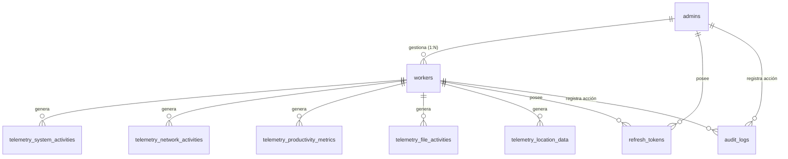

# Tarea 02: Capa de Base de Datos — Migraciones y Conexión SQLx

| Atributo | Detalle |
|:---|:---|
| **ID de Tarea** | `TASK-02` |
| **Módulos Afectados** | [`src/database/`](file:///Users/demian/Documents/GitHub/telemetry-api/src/database/), [`migrations/`](file:///Users/demian/Documents/GitHub/telemetry-api/migrations/) |
| **Dependencias** | [`TASK-01`](file:///Users/demian/Documents/GitHub/telemetry-api/tasks/task-01-foundations-config-errors.md) |
| **Prioridad** | Crítica / P0 |

---

## 1. Contexto y Arquitectura

La base de datos PostgreSQL 16 es la única fuente de verdad del sistema. Esta tarea define:
1. **Configuración del Pool de Conexiones SQLx:** Administración eficiente y asíncrona de conexiones mediante `PgPool` y `sqlx::postgres::PgPoolOptions`.
2. **Migraciones Versionadas:** Creación de archivos DDL en la carpeta `migrations/` con timestamp secuencial según el formato de SQLx.
3. **Esquema de Conocimiento Cero (Zero-Knowledge Storage):** Las tablas de telemetría almacenan los datos cifrados exclusivamente como columnas `BYTEA` (`encrypted_payload`) con metadatos descriptivos en texto claro (`client_timestamp`, `server_timestamp`, `worker_id`, `payload_size`, `batch_id`).
4. **Restricciones de Integridad y Privacidad a Nivel DB:**
   - Horas laborales: `work_hours_start < work_hours_end`.
   - Regla de privacidad: Un trabajador con `role_type = 'OFFICE'` no puede tener activa la bandera de consentimiento para ubicación (`location`).
   - Disparador automático (`TRIGGER`) para actualizar la columna `updated_at` en `admins` y `workers`.
   - Claves primarias UUID v7 time-sortables (`gen_random_uuid()` o generadas en servidor).



---

## 2. Requerimientos Funcionales y Esquema Relacional

### Migraciones a Implementar en `migrations/`

#### 1. Migración Inicial de Tipos y Tablas Core (`20240101000000_init_core_tables.sql`)
- Extensión `pgcrypto` o `uuid-ossp` si se requiere.
- Función de trigger `trigger_set_updated_at()`.
- Tabla `admins`:
  - `id UUID PRIMARY KEY`, `email VARCHAR(255) NOT NULL UNIQUE`, `password_hash VARCHAR(255) NOT NULL`, `name VARCHAR(255) NOT NULL`, `organization VARCHAR(255) NOT NULL`, `is_active BOOLEAN NOT NULL DEFAULT TRUE`, `created_at TIMESTAMPTZ NOT NULL DEFAULT NOW()`, `updated_at TIMESTAMPTZ NOT NULL DEFAULT NOW()`, `deleted_at TIMESTAMPTZ`.
  - Índice parcial único: `idx_admins_email` donde `deleted_at IS NULL`.
- Enum `worker_role_type`: `'OFFICE'`, `'FIELD'`.
- Tabla `workers`:
  - `id UUID PRIMARY KEY`, `admin_id UUID NOT NULL REFERENCES admins(id) ON DELETE CASCADE`, `email VARCHAR(255) NOT NULL`, `name VARCHAR(255) NOT NULL`, `device_identifier VARCHAR(512) NOT NULL`, `role_type worker_role_type NOT NULL DEFAULT 'OFFICE'`, `is_active BOOLEAN NOT NULL DEFAULT TRUE`, `consent_flags JSONB NOT NULL`, `work_hours_start TIME`, `work_hours_end TIME`, `timezone VARCHAR(50) NOT NULL DEFAULT 'America/Santiago'`, `created_at TIMESTAMPTZ`, `updated_at TIMESTAMPTZ`, `deleted_at TIMESTAMPTZ`.
  - Check constraint: `chk_workers_work_hours` (`work_hours_start < work_hours_end`).
  - Check constraint: `chk_workers_location_consent` (`NOT (consent_flags->>'location' = 'true' AND role_type = 'OFFICE')`).
  - Triggers para auto-actualización de `updated_at`.

#### 2. Migración de Tablas de Telemetría (`20240101000001_create_telemetry_tables.sql`)
- `telemetry_system_activities`: `id`, `worker_id`, `encrypted_payload BYTEA`, `payload_size INT`, `client_timestamp`, `server_timestamp`, `batch_id`, `created_at`.
- `telemetry_network_activities`: estructura análoga para dominios y navegación.
- Enum `productivity_subcategory`: `'BASIC'`, `'SCREENSHOT'`.
- `telemetry_productivity_metrics`: incluye columna `subcategory productivity_subcategory NOT NULL DEFAULT 'BASIC'`.
- `telemetry_file_activities`: estructura para registro de accesos a archivos corporativos.
- `telemetry_location_data`: estructura para coordenadas GPS de trabajadores `FIELD`.
- Índices compuestos en todas las tablas: `(worker_id, client_timestamp DESC)` y `(batch_id)`.

#### 3. Migración de Tokens y Auditoría (`20240101000002_create_auth_and_audit_tables.sql`)
- Enum `user_role`: `'ADMIN'`, `'WORKER'`.
- `refresh_tokens`: `id UUID PRIMARY KEY`, `user_id UUID NOT NULL`, `user_role user_role NOT NULL`, `token_hash VARCHAR(512) NOT NULL UNIQUE`, `expires_at TIMESTAMPTZ NOT NULL`, `is_revoked BOOLEAN NOT NULL DEFAULT FALSE`, `created_at TIMESTAMPTZ NOT NULL DEFAULT NOW()`, `revoked_at TIMESTAMPTZ`.
- `audit_logs`: `id UUID PRIMARY KEY`, `actor_id UUID NOT NULL`, `actor_role user_role NOT NULL`, `action VARCHAR(100) NOT NULL`, `resource_type VARCHAR(100) NOT NULL`, `resource_id UUID`, `ip_address INET`, `user_agent VARCHAR(512)`, `metadata JSONB`, `created_at TIMESTAMPTZ NOT NULL DEFAULT NOW()`.

---

## 3. Arquitectura de Código y Pseudocódigo

### Implementación del Módulo Database ([`src/database/mod.rs`](file:///Users/demian/Documents/GitHub/telemetry-api/src/database/mod.rs))

```rust
use sqlx::{postgres::PgPoolOptions, PgPool};
use std::time::Duration;
use crate::{config::Config, errors::AppError};

pub type DbPool = PgPool;

/// Inicializa el pool de conexiones de PostgreSQL y ejecuta migraciones pendientes.
pub async fn init_pool(config: &Config) -> Result<DbPool, AppError> {
    tracing::info!(
        max_connections = config.database_max_connections,
        "Connecting to PostgreSQL database..."
    );

    let pool = PgPoolOptions::new()
        .max_connections(config.database_max_connections)
        .acquire_timeout(Duration::from_secs(5))
        .idle_timeout(Duration::from_secs(600))
        .connect(&config.database_url)
        .await
        .map_err(AppError::Database)?;

    tracing::info!("Running pending database migrations...");
    sqlx::migrate!("./migrations")
        .run(&pool)
        .await
        .map_err(|e| {
            tracing::error!(error = %e, "Migration execution failed");
            AppError::Internal(anyhow::anyhow!("Migration failed: {}", e))
        })?;

    tracing::info!("Database migrations applied successfully.");
    Ok(pool)
}

/// Ejecuta un ping de verificación para asegurar que la conexión esté viva (Healthcheck).
pub async fn check_health(pool: &DbPool) -> Result<(), AppError> {
    sqlx::query("SELECT 1")
        .execute(pool)
        .await
        .map_err(AppError::Database)?;
    Ok(())
}
```

---

## 4. Prácticas de Programación y Reglas de Seguridad

- **Verificación en Tiempo de Compilación (`sqlx::query!`):** Los desarrolladores deben utilizar siempre consultas parametrizadas con comprobación de tipos en tiempo de compilación. Las consultas en crudo sin tipar sólo se permiten en el script de migración.
- **Inyección SQL Imposible:** Prohibida la concatenación manual de cadenas para armar sentencias SQL (`format!("SELECT * FROM ... WHERE id = '{}'", id)`). Todos los parámetros deben ligarse mediante `$1, $2, ...` o macros de SQLx.
- **Transacciones Atómicas:** Operaciones complejas (como registrar un lote de telemetría y generar un log de auditoría) deben encapsularse dentro de una transacción:
  ```rust
  let mut tx = pool.begin().await?;
  // sentencias...
  tx.commit().await?;
  ```
- **Principio de Privacidad por Diseño (Privacy by Design):** La restricción `chk_workers_location_consent` en la base de datos previene físicamente que un trabajador de oficina guarde consentimiento para ubicación geográfica, blindando la lógica de negocio frente a errores en la capa API.

---

## 5. Validaciones y Restricciones de Integridad

- **UUIDs:** Todos los identificadores son de tipo `UUID` (generados con la librería `uuid` versión 7 time-ordered en Rust o `gen_random_uuid()` en PostgreSQL).
- **Fechas y Tiempos:** Todas las columnas de fecha son de tipo `TIMESTAMPTZ` (UTC estricto).
- **Límites de Payload:** La columna `encrypted_payload` es de tipo `BYTEA` y no debe superar 10 MB (controlado por la capa de middleware y validadores de la API).

---

## 6. Logs y Observabilidad

- Registrar la apertura del pool de conexiones indicando número de conexiones configuradas y estado de las migraciones sin revelar la contraseña contenida en `DATABASE_URL`.
- Registrar en nivel `DEBUG` la adquisición y liberación de conexiones en entornos de desarrollo.
- En caso de fallo en migración, registrar el número de versión de la migración que falló.

---

## 7. Criterios de Aceptación y Definición de Terminado (DoD)

1. [ ] Archivos de migración creados en la carpeta `migrations/` conteniendo todas las definiciones DDL (tablas, tipos ENUM, índices, constraints y triggers).
2. [ ] El comando `sqlx migrate run` se ejecuta limpiamente contra una base de datos PostgreSQL local.
3. [ ] El método `init_pool` se conecta exitosamente, ejecuta migraciones y retorna una instancia válida de `PgPool`.
4. [ ] La función `check_health` ejecuta `SELECT 1` y retorna `Ok(())`.
5. [ ] Se comprueba que los constraints de integridad impidan guardar un worker con `work_hours_start > work_hours_end` y un worker `OFFICE` con `location: true`.

---

## 8. Especificación de Pruebas

### Pruebas de Integración con Base de Datos
- `test_db_migration_execution_succeeds`: Levantar pool con `sqlx::test` y comprobar que las 9 tablas existen y sus índices están creados.
- `test_db_worker_invalid_work_hours_fails`: Intentar insertar un worker con `work_hours_start = '18:00'` y `work_hours_end = '09:00'`, validando que PostgreSQL arroje violación de check constraint `chk_workers_work_hours`.
- `test_db_worker_office_location_consent_fails`: Intentar insertar un worker con `role_type = 'OFFICE'` y `consent_flags = '{"location": true}'`, verificando que la inserción sea rechazada por `chk_workers_location_consent`.
- `test_db_updated_at_trigger_updates_timestamp`: Actualizar un registro de `admins` y verificar que `updated_at` sea mayor a `created_at`.
