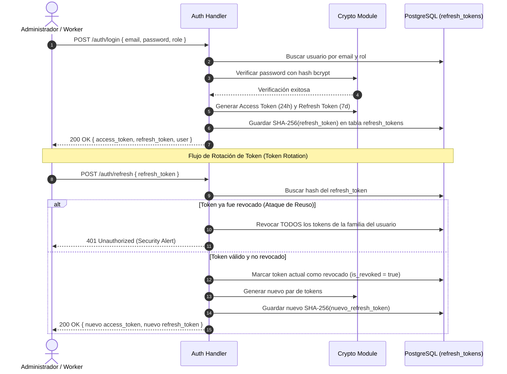

# Tarea 03: Módulo de Autenticación y Criptografía

| Atributo | Detalle |
|:---|:---|
| **ID de Tarea** | `TASK-03` |
| **Módulos Afectados** | [`src/auth/`](file:///Users/demian/Documents/GitHub/telemetry-api/src/auth/), [`src/crypto/`](file:///Users/demian/Documents/GitHub/telemetry-api/src/crypto/) |
| **Dependencias** | [`TASK-01`](file:///Users/demian/Documents/GitHub/telemetry-api/tasks/task-01-foundations-config-errors.md), [`TASK-02`](file:///Users/demian/Documents/GitHub/telemetry-api/tasks/task-02-database-migrations-and-pooling.md) |
| **Prioridad** | Crítica / P0 |

---

## 1. Contexto y Arquitectura

El módulo de autenticación gestiona la identidad de administradores y trabajadores. El sistema utiliza **JWT (JSON Web Tokens)** para sesiones sin estado junto con una estrategia estricta de **Rotación de Refresh Tokens (Token Family Security)**.

### Advertencia Crítica de Conocimiento Cero (Zero-Knowledge)
> [!CAUTION]
> El módulo [`src/crypto/`](file:///Users/demian/Documents/GitHub/telemetry-api/src/crypto/) en el servidor se limita **EXCLUSIVAMENTE** al hashing seguro de contraseñas de administradores y a la firma/verificación de tokens JWT.
> **BAJO NINGUNA CIRCUNSTANCIA** se debe implementar lógica de cifrado o descifrado de telemetría en el servidor. La telemetría es descifrada únicamente en el dispositivo del cliente.



---

## 2. Requerimientos Funcionales y Endpoints

### 1. `POST /api/v1/auth/register` (Público)
- Registra un nuevo administrador en el sistema.
- Crea el registro en `admins` con contraseña hasheada con bcrypt (cost factor 12) o Argon2id.
- Retorna `201 Created` con tokens de acceso y refresco.

### 2. `POST /api/v1/auth/login` (Público)
- Soporta inicio de sesión tanto para `ADMIN` como para `WORKER`.
- Verifica contraseña para administradores o device identifier / credencial según el modelo de acceso del trabajador.
- Genera par de tokens (Access Token duración 24h, Refresh Token duración 7 días).
- Retorna `200 OK`.

### 3. `POST /api/v1/auth/refresh` (Público con Refresh Token)
- Implementa rotación estricta: cada refresh token es de **un solo uso**.
- Al recibir un refresh token válido, se invalida de inmediato y se entrega un nuevo par.
- **Detección de Reuso:** Si se intenta refrescar con un token ya revocado, se asume un compromiso de credenciales y se revocan inmediatamente **todos** los tokens activos de ese usuario.

### 4. `POST /api/v1/auth/logout` (Autenticado)
- Invalida el refresh token provisto en el cuerpo de la petición marcándolo como revocado en la base de datos (`is_revoked = true`, `revoked_at = NOW()`).
- Retorna `204 No Content`.

---

## 3. Arquitectura de Código y Pseudocódigo

### A. Módulo Criptográfico ([`src/crypto/mod.rs`](file:///Users/demian/Documents/GitHub/telemetry-api/src/crypto/mod.rs))

```rust
use jsonwebtoken::{decode, encode, DecodingKey, EncodingKey, Header, Validation};
use serde::{Deserialize, Serialize};
use uuid::Uuid;
use chrono::{Duration, Utc};
use sha2::{Digest, Sha256};
use crate::errors::AppError;

#[derive(Debug, Serialize, Deserialize, Clone, PartialEq, Eq)]
#[serde(rename_all = "SCREAMING_SNAKE_CASE")]
pub enum UserRole {
    Admin,
    Worker,
}

#[derive(Debug, Serialize, Deserialize)]
pub struct Claims {
    pub sub: Uuid,             // ID del usuario (Admin ID o Worker ID)
    pub role: UserRole,        // Rol del usuario
    pub email: String,         // Correo
    pub exp: usize,            // Expiración UNIX timestamp
    pub iat: usize,            // Emitido en UNIX timestamp
    pub iss: String,           // Emisor: "telemetry-api"
}

/// Genera un token JWT de acceso válido por el tiempo configurado.
pub fn generate_access_token(
    user_id: Uuid,
    role: UserRole,
    email: &str,
    secret: &str,
    hours: i64,
) -> Result<String, AppError> {
    let now = Utc::now();
    let expiration = now + Duration::hours(hours);

    let claims = Claims {
        sub: user_id,
        role,
        email: email.to_string(),
        exp: expiration.timestamp() as usize,
        iat: now.timestamp() as usize,
        iss: "telemetry-api".to_string(),
    };

    encode(
        &Header::default(),
        &claims,
        &EncodingKey::from_secret(secret.as_bytes()),
    )
    .map_err(|e| AppError::Internal(anyhow::anyhow!("JWT generation error: {}", e)))
}

/// Valida un token JWT y retorna los Claims extraídos.
pub fn verify_jwt(token: &str, secret: &str) -> Result<Claims, AppError> {
    let mut validation = Validation::default();
    validation.set_issuer(&["telemetry-api"]);

    decode::<Claims>(
        token,
        &DecodingKey::from_secret(secret.as_bytes()),
        &validation,
    )
    .map(|data| data.claims)
    .map_err(|e| match e.kind() {
        jsonwebtoken::errors::ErrorKind::ExpiredSignature => {
            AppError::Unauthorized("Token has expired".to_string())
        }
        _ => AppError::Unauthorized("Invalid token signature".to_string()),
    })
}

/// Hashea un refresh token en SHA-256 para almacenamiento seguro en DB.
pub fn hash_token(token: &str) -> String {
    let mut hasher = Sha256::new();
    hasher.update(token.as_bytes());
    hex::encode(hasher.finalize())
}
```

### B. Manejo de Contraseñas Seguras

```rust
/// Hashea una contraseña usando bcrypt con coste 12.
pub fn hash_password(password: &str) -> Result<String, AppError> {
    bcrypt::hash(password, 12)
        .map_err(|e| AppError::Internal(anyhow::anyhow!("Password hashing error: {}", e)))
}

/// Compara una contraseña en texto plano contra su hash bcrypt.
pub fn verify_password(password: &str, hash: &str) -> Result<bool, AppError> {
    bcrypt::verify(password, hash)
        .map_err(|e| AppError::Internal(anyhow::anyhow!("Password verification error: {}", e)))
}
```

### C. Lógica de Rotación en Handlers ([`src/auth/handlers.rs`](file:///Users/demian/Documents/GitHub/telemetry-api/src/auth/handlers.rs))

```rust
// Pseudocódigo del manejador de refresh token
pub async fn refresh_token_handler(
    State(state): State<Arc<AppState>>,
    Json(payload): Json<RefreshTokenRequest>,
) -> Result<Json<SingleResponse<TokenResponse>>, AppError> {
    let token_hash = crypto::hash_token(&payload.refresh_token);

    // 1. Buscar token en DB
    let token_record = sqlx::query!(
        "SELECT id, user_id, user_role, is_revoked, expires_at FROM refresh_tokens WHERE token_hash = $1",
        token_hash
    )
    .fetch_optional(&state.db)
    .await?;

    let token = match token_record {
        Some(t) => t,
        None => return Err(AppError::Unauthorized("Invalid refresh token".to_string())),
    };

    // 2. Detección de Reuso: Si ya estaba revocado, revocar toda la familia
    if token.is_revoked {
        tracing::warn!(
            user_id = %token.user_id,
            "Security Alert: Revoked refresh token reuse attempted. Invalidating all user tokens."
        );
        sqlx::query!(
            "UPDATE refresh_tokens SET is_revoked = TRUE, revoked_at = NOW() WHERE user_id = $1",
            token.user_id
        )
        .execute(&state.db)
        .await?;

        return Err(AppError::Unauthorized("Token compromise detected. Please login again.".to_string()));
    }

    // 3. Verificar expiración
    if token.expires_at < Utc::now() {
        return Err(AppError::Unauthorized("Refresh token has expired".to_string()));
    }

    // 4. Revocar el token actual (Single Use)
    sqlx::query!(
        "UPDATE refresh_tokens SET is_revoked = TRUE, revoked_at = NOW() WHERE id = $1",
        token.id
    )
    .execute(&state.db)
    .await?;

    // 5. Emitir nuevo par de tokens y guardar el nuevo hash
    let new_access_token = crypto::generate_access_token(token.user_id, /*...*/)?;
    let new_refresh_token = crypto::generate_secure_random_token();
    let new_hash = crypto::hash_token(&new_refresh_token);

    // Guardar nuevo token en DB...
    Ok(Json(SingleResponse { data: TokenResponse { /*...*/ } }))
}
```

---

## 4. Prácticas de Programación y Reglas de Seguridad

- **Política de Complejidad de Contraseñas:** Validar con el crate `validator` o regex:
  - Mínimo 8 caracteres, máximo 72 caracteres (límite de bcrypt).
  - Al menos 1 mayúscula, 1 minúscula, 1 dígito numérico y 1 símbolo especial (`!@#$%^&*()_+-=`).
- **Timing Attacks:** La función `verify_password` previene ataques de canal lateral (timing attacks) comparando hashes en tiempo constante.
- **Almacenamiento de Tokens de Refresco:** Nunca almacenar refresh tokens en texto plano en la base de datos; almacenar siempre su hash criptográfico SHA-256 (`token_hash`).

---

## 5. Validaciones y Restricciones

- **Cuerpo de Petición Login/Register:**
  - `email`: Formato RFC 5322 válido.
  - `password`: Validado contra la regla de complejidad antes de cualquier operación en base de datos.
  - `role`: Debe ser un valor estrictamente deserializable a `UserRole` (`ADMIN` o `WORKER`).

---

## 6. Logs y Observabilidad

- **Permitido:**
  - `tracing::info!(user_id = %id, role = ?role, "User successfully authenticated");`
  - `tracing::warn!(email = %req.email, "Failed login attempt: invalid credentials");`
  - `tracing::warn!(user_id = %token.user_id, "Revoked refresh token reuse detected!");`
- **Prohibido Estrictamente:**
  - ❌ Loguear el valor del password en texto plano.
  - ❌ Loguear el valor del `access_token` o `refresh_token`.
  - ❌ Loguear la clave de firma `JWT_SECRET`.

---

## 7. Criterios de Aceptación y Definición de Terminado (DoD)

1. [ ] Endpoints `/api/v1/auth/register`, `/api/v1/auth/login`, `/api/v1/auth/refresh` y `/api/v1/auth/logout` completamente operativos.
2. [ ] Las contraseñas se almacenan exclusivamente como hashes bcrypt de costo 12.
3. [ ] Cada refresh token se invalida tras su uso (rotación de un solo uso).
4. [ ] Si se detecta el reuso de un token revocado, todos los tokens activos del usuario son revocados inmediatamente.
5. [ ] Pruebas unitarias de criptografía y validación de tokens pasando exitosamente.
6. [ ] Cero warnings con `cargo clippy`.

---

## 8. Especificación de Pruebas

### Pruebas Unitarias
- `test_auth_password_hashing_and_verification`: Comprobar que una contraseña válida verifica correctamente contra su hash y una contraseña incorrecta retorna falso.
- `test_auth_jwt_token_generation_and_expiry`: Generar un token con duración de 0 segundos y comprobar que `verify_jwt` retorna `AppError::Unauthorized` por firma expirada.
- `test_auth_password_policy_validation`: Comprobar que contraseñas cortas (< 8) o sin caracteres especiales fallan la validación con `AppError::Validation`.

### Pruebas de Integración (Base de Datos)
- `test_auth_login_with_valid_credentials_returns_tokens`: Registrar un admin y ejecutar login, esperando status 200 y tokens en la respuesta.
- `test_auth_refresh_token_rotation_and_invalidation`: Refrescar un token, comprobar que el segundo intento con el mismo token es rechazado y revoca los tokens restantes.
