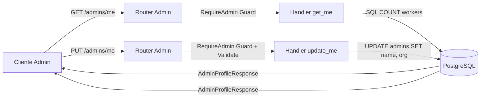

# Tarea 05: Módulo de Dominio de Administradores (Admin Module)

| Atributo | Detalle |
|:---|:---|
| **ID de Tarea** | `TASK-05` |
| **Módulos Afectados** | [`src/admin/`](file:///Users/demian/Documents/GitHub/telemetry-api/src/admin/) |
| **Dependencias** | [`TASK-02`](file:///Users/demian/Documents/GitHub/telemetry-api/tasks/task-02-database-migrations-and-pooling.md), [`TASK-03`](file:///Users/demian/Documents/GitHub/telemetry-api/tasks/task-03-authentication-and-crypto.md), [`TASK-04`](file:///Users/demian/Documents/GitHub/telemetry-api/tasks/task-04-middleware-pipeline-and-guards.md) |
| **Prioridad** | Media / P1 |

---

## 1. Contexto y Arquitectura

El módulo de administradores encapsula la gestión de las cuentas directivas de la plataforma. Cada administrador representa una organización o supervisor que tiene asignados uno o múltiples trabajadores (`Worker`).

Este módulo implementa:
1. **Modelos DTO:** Separación estricta entre el modelo interno de base de datos (`Admin`), el cuerpo de actualización (`UpdateAdminRequest`) y el objeto de respuesta seguro (`AdminProfileResponse`).
2. **Handlers de Perfil:** Consulta y actualización del perfil del administrador autenticado.
3. **Métricas Agregadas:** Retorno dinámico del conteo de trabajadores activos gestionados por el administrador sin necesidad de cargar todos los registros en memoria.
4. **Protección RBAC:** Todas las rutas del módulo requieren el guard `RequireAdmin`.



---

## 2. Requerimientos Funcionales y Endpoints

### 1. `GET /api/v1/admins/me`
- **Autenticación:** Requerida (`RequireAdmin`).
- **Comportamiento:** Obtiene los datos del perfil del administrador autenticado (`sub` en el JWT).
- **Métricas:** Debe incluir el campo computado `worker_count` con la cantidad de trabajadores activos asignados a este admin (`is_active = TRUE AND deleted_at IS NULL`).
- **Respuesta:** `200 OK` con `SingleResponse<AdminProfileResponse>`.

### 2. `PUT /api/v1/admins/me`
- **Autenticación:** Requerida (`RequireAdmin`).
- **Cuerpo de Petición:** `UpdateAdminRequest` (`name: Option<String>`, `organization: Option<String>`).
- **Regla de Negocio:** El correo electrónico (`email`) **NO** puede ser modificado mediante este endpoint para evitar secuestro de cuentas sin flujo de confirmación.
- **Respuesta:** `200 OK` con `SingleResponse<AdminProfileResponse>`.

---

## 3. Arquitectura de Código y Pseudocódigo

### A. Modelos y DTOs ([`src/admin/models.rs`](file:///Users/demian/Documents/GitHub/telemetry-api/src/admin/models.rs))

```rust
use chrono::{DateTime, Utc};
use serde::{Deserialize, Serialize};
use uuid::Uuid;
use validator::Validate;

/// Representación interna de la fila en la tabla admins.
#[derive(Debug, sqlx::FromRow)]
pub struct Admin {
    pub id: Uuid,
    pub email: String,
    pub password_hash: String,
    pub name: String,
    pub organization: String,
    pub is_active: bool,
    pub created_at: DateTime<Utc>,
    pub updated_at: DateTime<Utc>,
    pub deleted_at: Option<DateTime<Utc>>,
}

/// DTO de actualización de perfil de administrador.
#[derive(Debug, Deserialize, Validate)]
pub struct UpdateAdminRequest {
    #[validate(length(min = 2, max = 255, message = "Name must be between 2 and 255 characters"))]
    pub name: Option<String>,

    #[validate(length(min = 2, max = 255, message = "Organization must be between 2 and 255 characters"))]
    pub organization: Option<String>,
}

/// DTO de respuesta pública del perfil de administrador.
#[derive(Debug, Serialize)]
pub struct AdminProfileResponse {
    pub id: Uuid,
    pub email: String,
    pub name: String,
    pub organization: String,
    pub is_active: bool,
    pub worker_count: i64,
    pub created_at: DateTime<Utc>,
    pub updated_at: DateTime<Utc>,
}
```

### B. Handlers de Negocio ([`src/admin/handlers.rs`](file:///Users/demian/Documents/GitHub/telemetry-api/src/admin/handlers.rs))

```rust
use axum::{extract::State, Json};
use validator::Validate;
use crate::{
    admin::models::{AdminProfileResponse, UpdateAdminRequest},
    errors::AppError,
    middleware::RequireAdmin,
    models::SingleResponse,
    AppState,
};

/// Obtiene el perfil del administrador autenticado junto con su conteo de trabajadores.
pub async fn get_me(
    RequireAdmin(admin): RequireAdmin,
    State(state): State<AppState>,
) -> Result<Json<SingleResponse<AdminProfileResponse>>, AppError> {
    let admin_id = admin.id;

    // Consulta SQL con compile-time check para perfil y conteo
    let record = sqlx::query!(
        r#"
        SELECT 
            a.id, a.email, a.name, a.organization, a.is_active, a.created_at, a.updated_at,
            (SELECT COUNT(*) FROM workers w WHERE w.admin_id = a.id AND w.deleted_at IS NULL AND w.is_active = TRUE) as "worker_count!"
        FROM admins a
        WHERE a.id = $1 AND a.deleted_at IS NULL
        "#,
        admin_id
    )
    .fetch_optional(&state.db)
    .await?
    .ok_or_else(|| AppError::NotFound("Admin profile not found".to_string()))?;

    let response = AdminProfileResponse {
        id: record.id,
        email: record.email,
        name: record.name,
        organization: record.organization,
        is_active: record.is_active,
        worker_count: record.worker_count,
        created_at: record.created_at,
        updated_at: record.updated_at,
    };

    Ok(Json(SingleResponse { data: response }))
}

/// Actualiza los datos del perfil del administrador autenticado.
pub async fn update_me(
    RequireAdmin(admin): RequireAdmin,
    State(state): State<AppState>,
    Json(payload): Json<UpdateAdminRequest>,
) -> Result<Json<SingleResponse<AdminProfileResponse>>, AppError> {
    payload.validate().map_err(|e| AppError::Validation(e.to_string()))?;

    let admin_id = admin.id;

    // Actualización dinámica según los campos provistos
    let record = sqlx::query!(
        r#"
        UPDATE admins
        SET 
            name = COALESCE($1, name),
            organization = COALESCE($2, organization),
            updated_at = NOW()
        WHERE id = $3 AND deleted_at IS NULL
        RETURNING id, email, name, organization, is_active, created_at, updated_at
        "#,
        payload.name,
        payload.organization,
        admin_id
    )
    .fetch_optional(&state.db)
    .await?
    .ok_or_else(|| AppError::NotFound("Admin profile not found".to_string()))?;

    let worker_count = sqlx::query_scalar!(
        r#"SELECT COUNT(*) FROM workers WHERE admin_id = $1 AND deleted_at IS NULL AND is_active = TRUE"#,
        admin_id
    )
    .fetch_one(&state.db)
    .await?
    .unwrap_or(0);

    tracing::info!(admin_id = %admin_id, "Admin profile updated");

    Ok(Json(SingleResponse {
        data: AdminProfileResponse {
            id: record.id,
            email: record.email,
            name: record.name,
            organization: record.organization,
            is_active: record.is_active,
            worker_count,
            created_at: record.created_at,
            updated_at: record.updated_at,
        },
    }))
}
```

### C. Enrutador del Módulo ([`src/admin/routes.rs`](file:///Users/demian/Documents/GitHub/telemetry-api/src/admin/routes.rs))

```rust
use axum::{routing::{get, put}, Router};
use crate::{admin::handlers, AppState};

pub fn router() -> Router<AppState> {
    Router::new()
        .route("/admins/me", get(handlers::get_me))
        .route("/admins/me", put(handlers::update_me))
}
```

---

## 4. Prácticas de Programación y Reglas de Seguridad

- **Protección de Datos Sensibles:** `password_hash` nunca debe formar parte de `AdminProfileResponse`.
- **Validación con Crate `validator`:** Ejecutar siempre `payload.validate()?` antes de interactuar con la base de datos para asegurar longitudes mínimas y evitar strings vacíos o caracteres de control no permitidos.
- **Inmutabilidad de Identificadores:** Prohibir cualquier modificación de `id` o `email` en endpoints de actualización directa.

---

## 5. Validaciones y Restricciones

- `name`: Longitud entre 2 y 255 caracteres UTF-8 legibles.
- `organization`: Longitud entre 2 y 255 caracteres UTF-8 legibles.
- Al menos un campo debe estar presente en el cuerpo de `PUT /admins/me` si no se desea una operación vacía.

---

## 6. Logs y Observabilidad

- Registrar la actualización de perfil: `tracing::info!(admin_id = %admin_id, "Admin profile updated successfully")`.
- Registrar con nivel `WARN` si se detecta un intento de actualizar un administrador dado de baja (`deleted_at IS NOT NULL`).

---

## 7. Criterios de Aceptación y Definición de Terminado (DoD)

1. [ ] Endpoints `GET /api/v1/admins/me` y `PUT /api/v1/admins/me` protegidos por `RequireAdmin`.
2. [ ] `worker_count` calcula con precisión el número de trabajadores activos.
3. [ ] `AdminProfileResponse` nunca expone hashes de contraseñas.
4. [ ] Validación estricta de cadenas (2-255 caracteres) operativa.
5. [ ] Pruebas unitarias y de integración pasando al 100%.

---

## 8. Especificación de Pruebas

### Pruebas Unitarias
- `test_admin_update_validation_short_name_fails`: Probar que un nombre de 1 carácter retorne error de validación 400.
- `test_admin_profile_response_serialization_excludes_password`: Verificar que el JSON resultante de serializar `AdminProfileResponse` no contenga `"password"` ni `"password_hash"`.

### Pruebas de Integración (Base de Datos)
- `test_admin_get_me_returns_profile_and_worker_count`: Crear un admin y asociarle 3 trabajadores (2 activos, 1 inactivo); verificar que `worker_count` sea exactamente 2.
- `test_admin_update_me_modifies_name_and_updates_timestamp`: Actualizar `organization` y comprobar que la base de datos refleje el nuevo valor y un `updated_at` más reciente.
