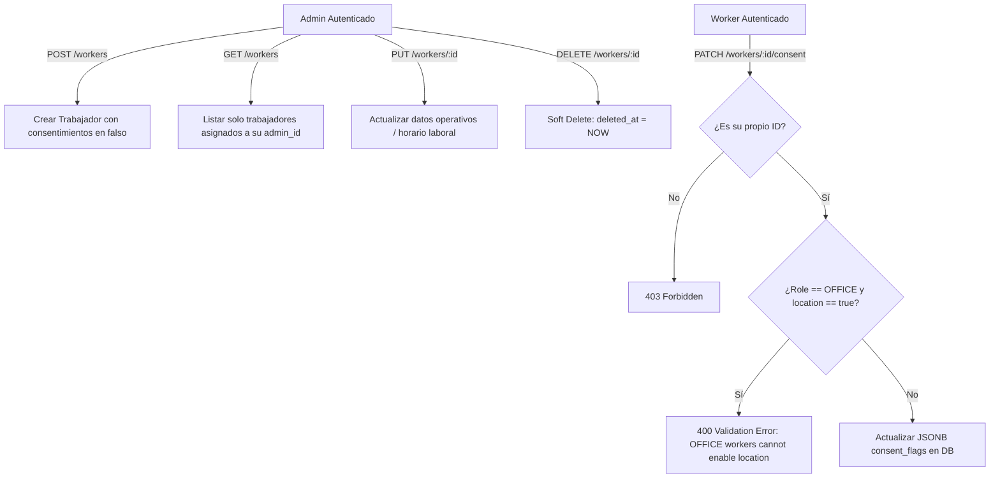

# Tarea 06: Módulo de Dominio de Trabajadores y Consentimientos (Worker Module)

| Atributo | Detalle |
|:---|:---|
| **ID de Tarea** | `TASK-06` |
| **Módulos Afectados** | [`src/worker/`](file:///Users/demian/Documents/GitHub/telemetry-api/src/worker/) |
| **Dependencias** | [`TASK-02`](file:///Users/demian/Documents/GitHub/telemetry-api/tasks/task-02-database-migrations-and-pooling.md), [`TASK-04`](file:///Users/demian/Documents/GitHub/telemetry-api/tasks/task-04-middleware-pipeline-and-guards.md), [`TASK-05`](file:///Users/demian/Documents/GitHub/telemetry-api/tasks/task-05-admin-domain-module.md) |
| **Prioridad** | Crítica / P0 |

---

## 1. Contexto y Arquitectura

El módulo de trabajadores (`Worker`) gestiona el ciclo de vida del personal monitoreado, sus dispositivos autorizados, y lo más relevante en términos de privacidad legal: **la matriz granular de banderas de consentimiento (`consent_flags`)**.

### Principios Fundamentales
1. **Consentimiento Exclusivo del Trabajador:** Sólo el trabajador (`RequireWorker`) puede modificar sus propias banderas de consentimiento a través de `PATCH /workers/:id/consent`. Un administrador **NO** puede forzar el encendido de consentimientos.
2. **Restricción de Privacidad para Geolocalización:** Un trabajador con rol `OFFICE` tiene terminantemente prohibido habilitar la bandera `location`. Cualquier intento es bloqueado tanto a nivel de aplicación (validación de handler) como a nivel de base de datos (check constraint `chk_workers_location_consent`).
3. **Aislamiento Multi-Tenant de Administradores:** Las consultas de listado y operaciones CRUD de trabajadores filtran estrictamente por `admin_id` del token JWT del administrador.



---

## 2. Requerimientos Funcionales y Endpoints

### 1. `POST /api/v1/workers`
- **Autorización:** `RequireAdmin`.
- **Cuerpo de Petición:** `CreateWorkerRequest` (`email`, `name`, `device_identifier`, `role_type`, `work_hours_start`, `work_hours_end`, `timezone`).
- **Comportamiento:** Asigna automáticamente `admin_id = admin.id`. Inicializa todas las banderas de consentimiento en `false`.
- **Respuesta:** `201 Created` con `WorkerResponse`.

### 2. `GET /api/v1/workers`
- **Autorización:** `RequireAdmin`.
- **Parámetros de Consulta:** `page`, `per_page`, `is_active`, `role_type`, `search` (búsqueda parcial por nombre o email), `sort`, `order`.
- **Comportamiento:** Retorna la lista paginada de trabajadores del admin autenticado.
- **Respuesta:** `200 OK` con `CollectionResponse<WorkerResponse>`.

### 3. `GET /api/v1/workers/:id`
- **Autorización:** Permitido para el `Admin` propietario del trabajador **O** para el propio `Worker` autenticado (`auth_user.id == worker.id`).
- **Respuesta:** `200 OK` con `SingleResponse<WorkerResponse>`.

### 4. `PUT /api/v1/workers/:id`
- **Autorización:** `RequireAdmin` (verificando propiedad mediante `verify_admin_owns_worker`).
- **Cuerpo:** `UpdateWorkerRequest` (permite actualizar nombre, device, rol, horario laboral, timezone, estado activo).
- **Respuesta:** `200 OK`.

### 5. `PATCH /api/v1/workers/:id/consent`
- **Autorización:** Exclusivamente el propio trabajador (`RequireWorker` donde `worker.id == path_id`).
- **Regla Estricta:** Si `worker.role_type == 'OFFICE'` y `consent_flags.location == true`, retornar `400 Bad Request` (`VALIDATION_ERROR`).
- **Respuesta:** `200 OK` con el objeto actualizado de consentimientos.

### 6. `DELETE /api/v1/workers/:id`
- **Autorización:** `RequireAdmin` (propietario).
- **Comportamiento:** Soft delete (`deleted_at = NOW()`, `is_active = FALSE`).
- **Respuesta:** `204 No Content`.

---

## 3. Arquitectura de Código y Pseudocódigo

### A. Modelos y Banderas de Consentimiento ([`src/worker/models.rs`](file:///Users/demian/Documents/GitHub/telemetry-api/src/worker/models.rs))

```rust
use chrono::{DateTime, NaiveTime, Utc};
use serde::{Deserialize, Serialize};
use uuid::Uuid;
use validator::Validate;

#[derive(Debug, Clone, Copy, PartialEq, Eq, Serialize, Deserialize, sqlx::Type)]
#[sqlx(type_name = "worker_role_type", rename_all = "SCREAMING_SNAKE_CASE")]
pub enum WorkerRoleType {
    Office,
    Field,
}

#[derive(Debug, Clone, Serialize, Deserialize, PartialEq, Eq)]
pub struct ConsentFlags {
    pub system_activity: bool,
    pub network_activity: bool,
    pub productivity_basic: bool,
    pub productivity_screenshots: bool,
    pub file_activity: bool,
    pub location: bool,
}

impl Default for ConsentFlags {
    fn default() -> Self {
        Self {
            system_activity: false,
            network_activity: false,
            productivity_basic: false,
            productivity_screenshots: false,
            file_activity: false,
            location: false,
        }
    }
}

#[derive(Debug, Deserialize, Validate)]
pub struct CreateWorkerRequest {
    #[validate(email(message = "Invalid email format"))]
    pub email: String,

    #[validate(length(min = 2, max = 255))]
    pub name: String,

    #[validate(length(min = 2, max = 512))]
    pub device_identifier: String,

    pub role_type: WorkerRoleType,
    pub work_hours_start: Option<NaiveTime>,
    pub work_hours_end: Option<NaiveTime>,
    pub timezone: Option<String>,
}

#[derive(Debug, Deserialize)]
pub struct UpdateConsentRequest {
    pub consent_flags: ConsentFlags,
}

#[derive(Debug, Serialize)]
pub struct WorkerResponse {
    pub id: Uuid,
    pub admin_id: Uuid,
    pub email: String,
    pub name: String,
    pub device_identifier: String,
    pub role_type: WorkerRoleType,
    pub is_active: bool,
    pub consent_flags: ConsentFlags,
    pub work_hours_start: Option<NaiveTime>,
    pub work_hours_end: Option<NaiveTime>,
    pub timezone: String,
    pub created_at: DateTime<Utc>,
    pub updated_at: DateTime<Utc>,
}
```

### B. Handlers de Negocio ([`src/worker/handlers.rs`](file:///Users/demian/Documents/GitHub/telemetry-api/src/worker/handlers.rs))

```rust
use axum::{
    extract::{Path, Query, State},
    http::StatusCode,
    Json,
};
use uuid::Uuid;
use validator::Validate;
use crate::{
    errors::AppError,
    middleware::{verify_admin_owns_worker, AuthUser, RequireAdmin, RequireWorker},
    models::{CollectionResponse, PaginationMeta, PaginationParams, SingleResponse},
    worker::models::*,
    AppState,
};

/// Registra un nuevo trabajador asignado al administrador en sesión.
pub async fn create_worker(
    RequireAdmin(admin): RequireAdmin,
    State(state): State<AppState>,
    Json(payload): Json<CreateWorkerRequest>,
) -> Result<(StatusCode, Json<SingleResponse<WorkerResponse>>), AppError> {
    payload.validate().map_err(|e| AppError::Validation(e.to_string()))?;

    // Validar coherencia de horario laboral si se especifica
    if let (Some(start), Some(end)) = (payload.work_hours_start, payload.work_hours_end) {
        if start >= end {
            return Err(AppError::Validation("work_hours_start must precede work_hours_end".to_string()));
        }
    }

    let default_consent = serde_json::to_value(ConsentFlags::default())
        .map_err(|e| AppError::Internal(e.into()))?;
    let timezone = payload.timezone.unwrap_or_else(|| "America/Santiago".to_string());

    let record = sqlx::query_as!(
        WorkerRecord,
        r#"
        INSERT INTO workers (
            admin_id, email, name, device_identifier, role_type, 
            consent_flags, work_hours_start, work_hours_end, timezone
        )
        VALUES ($1, $2, $3, $4, $5, $6, $7, $8, $9)
        RETURNING id, admin_id, email, name, device_identifier, 
                  role_type as "role_type: WorkerRoleType", is_active, 
                  consent_flags, work_hours_start, work_hours_end, 
                  timezone, created_at, updated_at
        "#,
        admin.id,
        payload.email,
        payload.name,
        payload.device_identifier,
        payload.role_type as WorkerRoleType,
        default_consent,
        payload.work_hours_start,
        payload.work_hours_end,
        timezone
    )
    .fetch_one(&state.db)
    .await
    .map_err(|e| match e {
        sqlx::Error::Database(ref db_err) if db_err.is_unique_violation() => {
            AppError::Conflict("A worker with this email already exists".to_string())
        }
        other => AppError::Database(other),
    })?;

    tracing::info!(worker_id = %record.id, admin_id = %admin.id, "Worker registered successfully");

    Ok((StatusCode::CREATED, Json(SingleResponse { data: record.into_response() })))
}

/// Actualización de consentimientos (Exclusivo para el Worker propietario).
pub async fn update_consent(
    RequireWorker(worker_auth): RequireWorker,
    Path(worker_id): Path<Uuid>,
    State(state): State<AppState>,
    Json(payload): Json<UpdateConsentRequest>,
) -> Result<Json<SingleResponse<ConsentFlags>>, AppError> {
    // 1. Verificar que el token pertenezca al worker del Path
    if worker_auth.id != worker_id {
        return Err(AppError::Forbidden("You can only modify your own consent flags".to_string()));
    }

    // 2. Obtener el rol del trabajador para validar restricciones de ubicación
    let worker = sqlx::query!(
        r#"SELECT role_type as "role_type: WorkerRoleType" FROM workers WHERE id = $1 AND deleted_at IS NULL"#,
        worker_id
    )
    .fetch_optional(&state.db)
    .await?
    .ok_or_else(|| AppError::NotFound("Worker not found".to_string()))?;

    // 3. Regla de privacidad: OFFICE no puede habilitar location
    if worker.role_type == WorkerRoleType::Office && payload.consent_flags.location {
        return Err(AppError::Validation("Workers with OFFICE role cannot consent to location tracking".to_string()));
    }

    let consent_json = serde_json::to_value(&payload.consent_flags)
        .map_err(|e| AppError::Internal(e.into()))?;

    sqlx::query!(
        "UPDATE workers SET consent_flags = $1, updated_at = NOW() WHERE id = $2",
        consent_json,
        worker_id
    )
    .execute(&state.db)
    .await?;

    tracing::info!(worker_id = %worker_id, "Consent flags updated by worker");

    Ok(Json(SingleResponse { data: payload.consent_flags }))
}
```

---

## 4. Prácticas de Programación y Reglas de Seguridad

- **Integridad de Pertenencia:** Todas las operaciones de administradores sobre trabajadores deben verificar que `worker.admin_id == admin.id`.
- **Soft Deletes:** Nunca ejecutar `DELETE FROM workers` directamente. Utilizar siempre `UPDATE workers SET deleted_at = NOW(), is_active = FALSE WHERE id = $1`.
- **Auditoría de Consentimiento:** Toda modificación a `consent_flags` debe ser registrada en la bitácora con los valores anteriores y los nuevos.

---

## 5. Validaciones y Restricciones

- `email`: Debe poseer estructura válida de correo electrónico.
- `work_hours_start` y `work_hours_end`: Si se envían, la hora de inicio debe ser estrictamente menor a la de fin.
- `role_type`: Obligatoriamente `OFFICE` o `FIELD`.

---

## 6. Logs y Observabilidad

- Registrar la creación de trabajadores: `tracing::info!(worker_id = %id, admin_id = %admin_id, "Worker created")`.
- Registrar cambios en consentimientos: `tracing::info!(worker_id = %id, "Worker consent updated")`.
- Alertar intentos ilegítimos de modificación de consentimientos ajenos con `WARN`.

---

## 7. Criterios de Aceptación y Definición de Terminado (DoD)

1. [ ] Rutas CRUD de trabajadores implementadas y asociadas al router en `src/worker/routes.rs`.
2. [ ] El trabajador sólo puede alterar sus propios consentimientos.
3. [ ] Trabajadores `OFFICE` que intenten activar `location` son rechazados con 400.
4. [ ] Listado de trabajadores soporta paginación, ordenamiento y búsqueda parcial.
5. [ ] Pruebas unitarias y de integración pasando sin advertencias.

---

## 8. Especificación de Pruebas

### Pruebas Unitarias
- `test_worker_create_with_invalid_hours_returns_validation_error`: Crear worker con inicio 18:00 y fin 09:00 esperando fallo 400.
- `test_worker_consent_office_enabling_location_fails`: Ejecutar `update_consent` para trabajador de oficina intentando activar `location: true` y comprobar retorno de error de validación.

### Pruebas de Integración (Base de Datos)
- `test_worker_admin_cannot_access_worker_of_another_admin`: Probar que un Admin B reciba 403 o 404 al intentar leer un worker del Admin A.
- `test_worker_soft_delete_excludes_from_active_list`: Eliminar un worker y verificar que ya no figure en el listado de `GET /workers`.
