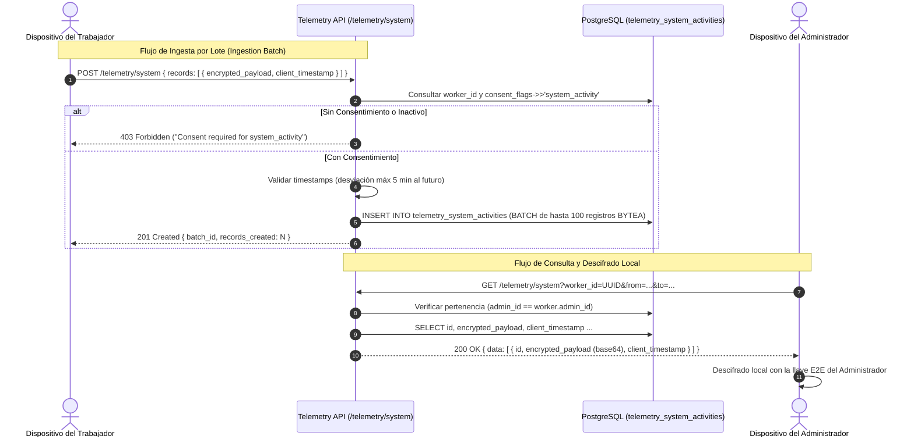

# Tarea 07: Telemetría Core I — Ingesta y Consulta de Actividad del Sistema y Red

| Atributo | Detalle |
|:---|:---|
| **ID de Tarea** | `TASK-07` |
| **Módulos Afectados** | [`src/telemetry/`](file:///Users/demian/Documents/GitHub/telemetry-api/src/telemetry/) (`system_activity.rs`, `network_activity.rs`, `handlers.rs`, `routes.rs`) |
| **Dependencias** | [`TASK-02`](file:///Users/demian/Documents/GitHub/telemetry-api/tasks/task-02-database-migrations-and-pooling.md), [`TASK-04`](file:///Users/demian/Documents/GitHub/telemetry-api/tasks/task-04-middleware-pipeline-and-guards.md), [`TASK-06`](file:///Users/demian/Documents/GitHub/telemetry-api/tasks/task-06-worker-domain-module.md) |
| **Prioridad** | Crítica / P0 |

---

## 1. Contexto y Arquitectura

Esta tarea implementa el motor de almacenamiento de conocimiento cero para las dos primeras categorías de telemetría:
1. **Actividad del Sistema (`system_activity`):** Métricas del SO (tiempo inactivo, aplicaciones activas, uso de CPU/RAM/red, periféricos USB).
2. **Actividad de Red (`network_activity`):** Registro de dominios y URLs navegadas.

### Garantía Crítica de Conocimiento Cero (Zero-Knowledge)
> [!IMPORTANT]
> El servidor **JAMÁS** descifra el contenido de `encrypted_payload`. La aplicación recibe una cadena en Base64 desde el cliente, la decodifica en un vector de bytes binario (`Vec<u8>`) y la guarda directamente en la columna `BYTEA` de PostgreSQL junto con sus metadatos.



---

## 2. Requerimientos Funcionales y Endpoints

### 1. `POST /api/v1/telemetry/system` y `POST /api/v1/telemetry/network`
- **Autorización:** `RequireWorker`.
- **Cuerpo de Petición:** `BatchTelemetrySubmission` conteniendo una lista de registros (`1` a `100` registros).
- **Validaciones Obligatorias:**
  - Máximo 100 registros por lote.
  - El trabajador debe estar activo (`is_active = TRUE`).
  - La bandera de consentimiento correspondiente (`system_activity` o `network_activity`) debe ser `true` en `workers.consent_flags`.
  - El `client_timestamp` no puede estar en el futuro (se admite una tolerancia máxima de 5 minutos por desajuste de reloj NTP).
- **Persistencia:** Se genera un `batch_id` (UUIDv7) común para todos los registros del lote y se almacena el blob `BYTEA` en base de datos.
- **Respuesta:** `201 Created` con `BatchIngestionResponse`.

### 2. `GET /api/v1/telemetry/system` y `GET /api/v1/telemetry/network`
- **Autorización:** `RequireAdmin`.
- **Parámetros de Consulta:**
  - `worker_id` (UUID, Obligatorio).
  - `from` (ISO 8601, opcional).
  - `to` (ISO 8601, opcional).
  - `page` (default: 1), `per_page` (default: 20, max: 100).
  - `sort` (`client_timestamp` o `server_timestamp`), `order` (`asc` o `desc`).
- **Verificación de Seguridad:** El administrador autenticado debe ser propietario del trabajador consultado.
- **Respuesta:** `200 OK` con `CollectionResponse<TelemetryRecordResponse>`.

### 3. `GET /api/v1/telemetry/{category}/:id` y `DELETE /api/v1/telemetry/{category}/:id`
- **Autorización:** `RequireAdmin` (propietario).
- Permite obtener o borrar físicamente un registro específico (derecho al olvido puntual).

---

## 3. Arquitectura de Código y Pseudocódigo

### A. Modelos Comunes de Telemetría ([`src/telemetry/models.rs`](file:///Users/demian/Documents/GitHub/telemetry-api/src/telemetry/models.rs))

```rust
use chrono::{DateTime, Utc};
use serde::{Deserialize, Serialize};
use uuid::Uuid;
use validator::Validate;

#[derive(Debug, Deserialize, Validate)]
pub struct TelemetryRecordDto {
    /// Payload cifrado en base64 emitido por el cliente
    pub encrypted_payload: String,

    /// Marca de tiempo de recolección en el cliente
    pub client_timestamp: DateTime<Utc>,
}

#[derive(Debug, Deserialize, Validate)]
pub struct BatchTelemetrySubmission {
    #[validate(length(min = 1, max = 100, message = "Batch must contain between 1 and 100 records"))]
    pub records: Vec<TelemetryRecordDto>,
}

#[derive(Debug, Serialize)]
pub struct BatchIngestionResponse {
    pub batch_id: Uuid,
    pub records_created: usize,
    pub category: &'static str,
    pub server_timestamp: DateTime<Utc>,
}

#[derive(Debug, Serialize)]
pub struct TelemetryRecordResponse {
    pub id: Uuid,
    pub worker_id: Uuid,
    pub encrypted_payload: String, // Base64 reenviado
    pub payload_size: i32,
    pub client_timestamp: DateTime<Utc>,
    pub server_timestamp: DateTime<Utc>,
    pub batch_id: Option<Uuid>,
}

#[derive(Debug, Deserialize)]
pub struct TelemetryQueryParams {
    pub worker_id: Uuid,
    pub from: Option<DateTime<Utc>>,
    pub to: Option<DateTime<Utc>>,
    pub page: Option<u32>,
    pub per_page: Option<u32>,
    pub sort: Option<String>,
    pub order: Option<String>,
}
```

### B. Ingesta de Lotes ([`src/telemetry/system_activity.rs`](file:///Users/demian/Documents/GitHub/telemetry-api/src/telemetry/system_activity.rs))

```rust
use axum::{extract::State, http::StatusCode, Json};
use chrono::{Duration, Utc};
use uuid::Uuid;
use validator::Validate;
use crate::{
    errors::AppError,
    middleware::RequireWorker,
    models::SingleResponse,
    telemetry::models::*,
    AppState,
};

pub async fn ingest_system_activity(
    RequireWorker(worker_auth): RequireWorker,
    State(state): State<AppState>,
    Json(payload): Json<BatchTelemetrySubmission>,
) -> Result<(StatusCode, Json<SingleResponse<BatchIngestionResponse>>), AppError> {
    payload.validate().map_err(|e| AppError::Validation(e.to_string()))?;

    let worker_id = worker_auth.id;

    // 1. Verificar consentimiento del trabajador para system_activity
    let consent_check = sqlx::query!(
        r#"
        SELECT is_active, consent_flags->>'system_activity' as "has_consent"
        FROM workers 
        WHERE id = $1 AND deleted_at IS NULL
        "#,
        worker_id
    )
    .fetch_optional(&state.db)
    .await?
    .ok_or_else(|| AppError::NotFound("Worker record not found".to_string()))?;

    if !consent_check.is_active {
        return Err(AppError::Forbidden("Worker account is inactive".to_string()));
    }

    if consent_check.has_consent.as_deref() != Some("true") {
        return Err(AppError::Forbidden("Worker has not given consent for system_activity telemetry".to_string()));
    }

    // 2. Validar timestamps de los registros
    let now = Utc::now();
    let max_future_allowed = now + Duration::minutes(5);

    for record in &payload.records {
        if record.client_timestamp > max_future_allowed {
            return Err(AppError::Validation("client_timestamp cannot be in the future (skew limit: 5m)".to_string()));
        }
    }

    // 3. Procesar e insertar registros en una transacción
    let batch_id = Uuid::now_v7();
    let count = payload.records.len();
    let mut tx = state.db.begin().await?;

    for record in payload.records {
        let binary_payload = base64::decode(&record.encrypted_payload)
            .map_err(|_| AppError::Validation("encrypted_payload must be valid base64".to_string()))?;
        let payload_size = binary_payload.len() as i32;

        sqlx::query!(
            r#"
            INSERT INTO telemetry_system_activities (
                worker_id, encrypted_payload, payload_size, client_timestamp, server_timestamp, batch_id
            )
            VALUES ($1, $2, $3, $4, $5, $6)
            "#,
            worker_id,
            binary_payload,
            payload_size,
            record.client_timestamp,
            now,
            batch_id
        )
        .execute(&mut *tx)
        .await?;
    }

    tx.commit().await?;

    tracing::info!(
        worker_id = %worker_id,
        category = "system_activity",
        records_count = count,
        batch_id = %batch_id,
        "Telemetry batch successfully ingested"
    );

    Ok((
        StatusCode::CREATED,
        Json(SingleResponse {
            data: BatchIngestionResponse {
                batch_id,
                records_created: count,
                category: "system",
                server_timestamp: now,
            },
        }),
    ))
}
```

---

## 4. Prácticas de Programación y Reglas de Seguridad

- **Regla Estricta de Tracing:** Prohibido imprimir `record.encrypted_payload` en logs de cualquier nivel (`debug`, `trace`, `info`). Loguear únicamente metadatos: `worker_id`, `records_count`, `batch_id`, `category`.
- **Validación Base64:** Decodificar de forma segura a `Vec<u8>` capturando errores de formateo antes de tocar la base de datos.
- **Inserción Transaccional:** El lote de hasta 100 registros se ejecuta dentro de una transacción (`tx.commit()`) para asegurar atomicidad.

---

## 5. Validaciones y Restricciones

- `records`: Entre 1 y 100 elementos por petición.
- `client_timestamp`: Dentro de la ventana válida ($\le \text{NOW} + 5 \text{ min}$).
- `encrypted_payload`: Formato Base64 RFC 4648 sin caracteres extraños.

---

## 6. Logs y Observabilidad

- Registrar cada ingesta con campos estructurados: `worker_id`, `category`, `records_count`, `batch_id`.
- Registrar con nivel `WARN` cualquier intento de ingesta sin consentimiento previo.

---

## 7. Criterios de Aceptación y Definición de Terminado (DoD)

1. [ ] Endpoints para `system` y `network` implementados (POST y GET con filtros).
2. [ ] Ingesta bloqueada con `403 Forbidden` si el trabajador no tiene activa la bandera de consentimiento.
3. [ ] Los registros se persisten como `BYTEA` sin alteración ni descifrado en el servidor.
4. [ ] El administrador solo puede consultar telemetría de trabajadores que le pertenecen.
5. [ ] Pruebas unitarias de decodificación y pruebas de base de datos pasando al 100%.

---

## 8. Especificación de Pruebas

### Pruebas Unitarias
- `test_telemetry_batch_empty_records_returns_validation_error`: Enviar `records: []` y verificar retorno de error 400.
- `test_telemetry_batch_exceeding_100_records_fails`: Enviar 101 registros y verificar rechazo 400.
- `test_telemetry_future_timestamp_rejected`: Enviar timestamp con 10 minutos en el futuro y comprobar rechazo.

### Pruebas de Integración (Base de Datos)
- `test_telemetry_ingest_without_consent_returns_403`: Configurar worker con `system_activity: false`, intentar ingesta y esperar 403 Forbidden.
- `test_telemetry_admin_retrieval_returns_correct_worker_records`: Insertar telemetría para Worker 1 y comprobar que la consulta del Admin retorne únicamente dichos registros con payload intacto.
