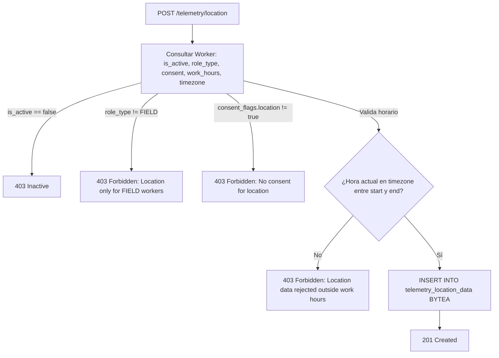

# Tarea 08: Telemetría Core II — Productividad, Archivos y Geolocalización con Validación Horaria

| Atributo | Detalle |
|:---|:---|
| **ID de Tarea** | `TASK-08` |
| **Módulos Afectados** | [`src/telemetry/`](file:///Users/demian/Documents/GitHub/telemetry-api/src/telemetry/) (`productivity.rs`, `file_activity.rs`, `location.rs`, `handlers.rs`, `routes.rs`) |
| **Dependencias** | [`TASK-02`](file:///Users/demian/Documents/GitHub/telemetry-api/tasks/task-02-database-migrations-and-pooling.md), [`TASK-06`](file:///Users/demian/Documents/GitHub/telemetry-api/tasks/task-06-worker-domain-module.md), [`TASK-07`](file:///Users/demian/Documents/GitHub/telemetry-api/tasks/task-07-telemetry-ingestion-system-network.md) |
| **Prioridad** | Crítica / P0 |

---

## 1. Contexto y Arquitectura

Esta tarea aborda las categorías de telemetría de mayor sensibilidad ética y regulatoria bajo normativas internacionales y locales de privacidad:
1. **Productividad (`productivity`):** Métricas de pulsaciones y clics (`BASIC`) y capturas de pantalla (`SCREENSHOT`).
2. **Archivos Corporativos (`files`):** Registros de lectura, modificación o eliminación de archivos corporativos.
3. **Geolocalización GPS (`location`):** Coordenadas geográficas para personal de terreno.

### Restricciones de Privacidad No Negociables
1. **Doble Consentimiento en Productividad:**
   - La subcategoría `BASIC` requiere `consent_flags.productivity_basic == true`.
   - La subcategoría `SCREENSHOT` requiere obligatoriamente `consent_flags.productivity_screenshots == true`. El consentimiento de capturas de pantalla es **independiente** y no se asume con el básico.
2. **Geocercas Temporales (Horario Laboral Estricto):**
   - La ingesta de ubicación requiere que el trabajador tenga `role_type = 'FIELD'`.
   - La recolección debe ocurrir **estrictamente dentro de la ventana horaria configurada** (`work_hours_start` a `work_hours_end`) en la zona horaria del trabajador (`timezone`). Fuera de ese rango, la ingesta es rechazada con `403 Forbidden`.



---

## 2. Requerimientos Funcionales y Endpoints

### 1. `POST /api/v1/telemetry/productivity`
- **Autorización:** `RequireWorker`.
- **Cuerpo:** Lote de registros donde cada elemento incluye el campo opcional `subcategory` (`BASIC` por defecto, o `SCREENSHOT`).
- **Comprobación:**
  - Si `subcategory == BASIC`: validar `consent_flags.productivity_basic == true`.
  - Si `subcategory == SCREENSHOT`: validar `consent_flags.productivity_screenshots == true`.
- **Persistencia:** Almacenar en `telemetry_productivity_metrics` con su correspondiente columna `subcategory`.

### 2. `POST /api/v1/telemetry/files`
- **Autorización:** `RequireWorker`.
- **Comprobación:** Validar `consent_flags.file_activity == true`.
- **Persistencia:** Guardar en `telemetry_file_activities`.

### 3. `POST /api/v1/telemetry/location`
- **Autorización:** `RequireWorker`.
- **Comprobación Triple:**
  1. `worker.role_type == WorkerRoleType::Field`.
  2. `worker.consent_flags.location == true`.
  3. Comprobar que el `client_timestamp` convertido a la zona horaria del trabajador (`worker.timezone`) caiga dentro del rango `[work_hours_start, work_hours_end]`.
- **Persistencia:** Guardar en `telemetry_location_data`.

### 4. Consultas Administrativas (`GET /api/v1/telemetry/{productivity|files|location}`)
- **Autorización:** `RequireAdmin` (con verificación de pertenencia `verify_admin_owns_worker`).
- Soporte para filtro por `subcategory` en productividad (`?subcategory=SCREENSHOT`).
- Paginación y ordenamiento temporal.

---

## 3. Arquitectura de Código y Pseudocódigo

### A. Modelos Específicos ([`src/telemetry/models.rs`](file:///Users/demian/Documents/GitHub/telemetry-api/src/telemetry/models.rs))

```rust
use serde::{Deserialize, Serialize};

#[derive(Debug, Clone, Copy, PartialEq, Eq, Serialize, Deserialize, sqlx::Type)]
#[sqlx(type_name = "productivity_subcategory", rename_all = "SCREAMING_SNAKE_CASE")]
pub enum ProductivitySubcategory {
    Basic,
    Screenshot,
}

#[derive(Debug, Deserialize, validator::Validate)]
pub struct ProductivityRecordDto {
    pub encrypted_payload: String,
    pub client_timestamp: chrono::DateTime<chrono::Utc>,
    #[serde(default = "default_subcategory")]
    pub subcategory: ProductivitySubcategory,
}

fn default_subcategory() -> ProductivitySubcategory {
    ProductivitySubcategory::Basic
}

#[derive(Debug, Deserialize, validator::Validate)]
pub struct BatchProductivitySubmission {
    #[validate(length(min = 1, max = 100))]
    pub records: Vec<ProductivityRecordDto>,
}
```

### B. Ingesta de Ubicación con Verificación Horaria ([`src/telemetry/location.rs`](file:///Users/demian/Documents/GitHub/telemetry-api/src/telemetry/location.rs))

```rust
use axum::{extract::State, http::StatusCode, Json};
use chrono::{DateTime, Utc};
use chrono_tz::Tz;
use uuid::Uuid;
use validator::Validate;
use crate::{
    errors::AppError,
    middleware::RequireWorker,
    models::SingleResponse,
    telemetry::models::*,
    worker::models::WorkerRoleType,
    AppState,
};

pub async fn ingest_location(
    RequireWorker(worker_auth): RequireWorker,
    State(state): State<AppState>,
    Json(payload): Json<BatchTelemetrySubmission>,
) -> Result<(StatusCode, Json<SingleResponse<BatchIngestionResponse>>), AppError> {
    payload.validate().map_err(|e| AppError::Validation(e.to_string()))?;

    let worker_id = worker_auth.id;

    // 1. Obtener datos del trabajador y configuración horaria
    let worker = sqlx::query!(
        r#"
        SELECT 
            is_active, 
            role_type as "role_type: WorkerRoleType", 
            consent_flags->>'location' as "has_consent",
            work_hours_start,
            work_hours_end,
            timezone
        FROM workers 
        WHERE id = $1 AND deleted_at IS NULL
        "#,
        worker_id
    )
    .fetch_optional(&state.db)
    .await?
    .ok_or_else(|| AppError::NotFound("Worker record not found".to_string()))?;

    // 2. Validaciones de estado, rol y consentimiento
    if !worker.is_active {
        return Err(AppError::Forbidden("Worker account is inactive".to_string()));
    }

    if worker.role_type != WorkerRoleType::Field {
        return Err(AppError::Forbidden("Location tracking is only permitted for FIELD workers".to_string()));
    }

    if worker.has_consent.as_deref() != Some("true") {
        return Err(AppError::Forbidden("Worker has not provided consent for location tracking".to_string()));
    }

    // 3. Validación de Ventana Horaria Laboral (Work Hours Validation)
    let (start_time, end_time) = match (worker.work_hours_start, worker.work_hours_end) {
        (Some(start), Some(end)) => (start, end),
        _ => return Err(AppError::Forbidden("Worker does not have configured work hours for location telemetry".to_string())),
    };

    let tz: Tz = worker.timezone.parse().unwrap_or(chrono_tz::America::Santiago);

    // Validar cada timestamp contra la zona horaria del trabajador
    for record in &payload.records {
        let local_time = record.client_timestamp.with_timezone(&tz).time();
        if local_time < start_time || local_time > end_time {
            tracing::warn!(
                worker_id = %worker_id,
                local_time = %local_time,
                start = %start_time,
                end = %end_time,
                "Location rejected: outside configured work hours"
            );
            return Err(AppError::Forbidden("Location telemetry cannot be submitted outside configured work hours".to_string()));
        }
    }

    // 4. Inserción transaccional de coordenadas cifradas
    let batch_id = Uuid::now_v7();
    let now = Utc::now();
    let count = payload.records.len();
    let mut tx = state.db.begin().await?;

    for record in payload.records {
        let binary_payload = base64::decode(&record.encrypted_payload)
            .map_err(|_| AppError::Validation("Invalid base64 payload".to_string()))?;

        sqlx::query!(
            r#"
            INSERT INTO telemetry_location_data (
                worker_id, encrypted_payload, payload_size, client_timestamp, server_timestamp, batch_id
            )
            VALUES ($1, $2, $3, $4, $5, $6)
            "#,
            worker_id,
            binary_payload,
            binary_payload.len() as i32,
            record.client_timestamp,
            now,
            batch_id
        )
        .execute(&mut *tx)
        .await?;
    }

    tx.commit().await?;

    Ok((
        StatusCode::CREATED,
        Json(SingleResponse {
            data: BatchIngestionResponse {
                batch_id,
                records_created: count,
                category: "location",
                server_timestamp: now,
            },
        }),
    ))
}
```

---

## 4. Prácticas de Programación y Reglas de Seguridad

- **Manejo Seguro de Zonas Horarias:** Convertir siempre `client_timestamp` (en UTC) a la zona horaria configurada del trabajador usando `chrono-tz` antes de comparar con `NaiveTime`.
- **Prevención de Exposición de Archivos:** Las rutas de archivos monitoreadas viajan cifradas dentro del payload. El servidor nunca conoce qué directorios o archivos fueron modificados.
- **Tamaño de Capturas de Pantalla:** Limitar las peticiones con subcategoría `SCREENSHOT` asegurando que no excedan el límite de 10MB globales configurado en el middleware.

---

## 5. Validaciones y Restricciones

- `ProductivitySubcategory`: Debe ser exactamente `'BASIC'` o `'SCREENSHOT'`.
- Horas de trabajo: Si `work_hours_start` o `work_hours_end` no están configurados, no se permite la recolección de ubicación (principio de precaución).

---

## 6. Logs y Observabilidad

- Registrar intentos de envío de ubicación fuera de horario laboral con nivel `WARN` incluyendo hora local computada.
- Registrar conteo de capturas de pantalla y registros de productividad sin volcar ningún byte del payload.

---

## 7. Criterios de Aceptación y Definición de Terminado (DoD)

1. [ ] Endpoints de `productivity`, `files` y `location` implementados y operativos.
2. [ ] Validación independiente entre `productivity_basic` y `productivity_screenshots`.
3. [ ] Ubicación rechazada con 403 si el trabajador es de rol `OFFICE`.
4. [ ] Ubicación rechazada con 403 si la petición se envía fuera del horario laboral configurado.
5. [ ] Pruebas unitarias de cálculo de horario y pruebas de integración en verde.

---

## 8. Especificación de Pruebas

### Pruebas Unitarias
- `test_location_ingestion_outside_work_hours_fails`: Configurar horario de 09:00 a 18:00; enviar coordenada con timestamp equivalente a las 20:00 local y comprobar rechazo 403.
- `test_productivity_screenshot_without_screenshot_consent_fails`: Worker con `productivity_basic: true` pero `productivity_screenshots: false` intenta enviar registro `SCREENSHOT` y es rechazado con 403.

### Pruebas de Integración (Base de Datos)
- `test_location_office_worker_rejected`: Intentar ingresar ubicación para un trabajador con `role_type = 'OFFICE'` y verificar retorno 403.
- `test_productivity_filter_by_subcategory_admin`: Verificar que el query param `?subcategory=SCREENSHOT` filtre adecuadamente los resultados en la consulta del Admin.
