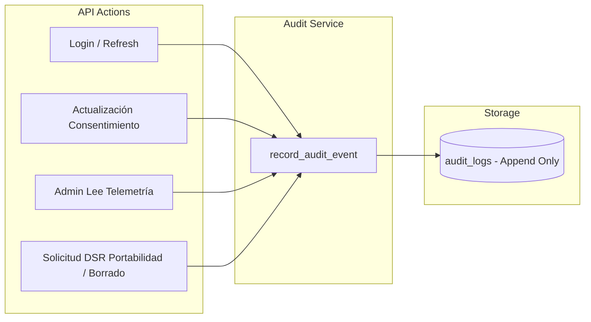

# Tarea 09: Servicio de Auditoría Inmutable y Derechos del Titular (DSR / Compliance)

| Atributo | Detalle |
|:---|:---|
| **ID de Tarea** | `TASK-09` |
| **Módulos Afectados** | [`src/models/`](file:///Users/demian/Documents/GitHub/telemetry-api/src/models/), [`src/worker/`](file:///Users/demian/Documents/GitHub/telemetry-api/src/worker/) (`handlers.rs`, `routes.rs`), nuevo submódulo de auditoría |
| **Dependencias** | [`TASK-02`](file:///Users/demian/Documents/GitHub/telemetry-api/tasks/task-02-database-migrations-and-pooling.md), [`TASK-04`](file:///Users/demian/Documents/GitHub/telemetry-api/tasks/task-04-middleware-pipeline-and-guards.md), [`TASK-06`](file:///Users/demian/Documents/GitHub/telemetry-api/tasks/task-06-worker-domain-module.md) |
| **Prioridad** | Alta / P1 |

---

## 1. Contexto y Arquitectura

Para cumplir con estándares normativos de protección de datos (GDPR y Ley 19.628 de Chile), el sistema debe proveer:
1. **Pista de Auditoría Inmutable (`audit_logs`):** Registro de eventos críticos de seguridad y accesos a datos personales (inicios de sesión, cambios de consentimiento, consultas de telemetría por parte de administradores).
2. **Derecho a la Portabilidad y Acceso (`POST /workers/me/data-request`):** Mecanismo para que el trabajador solicite la exportación de sus datos.
3. **Derecho al Olvido / Supresión (`POST /workers/me/data-deletion`):** Mecanismo para que el trabajador solicite la eliminación completa o parcial de su historial de telemetría.



---

## 2. Requerimientos Funcionales y Endpoints

### 1. Servicio Central de Auditoría
- Proporciona una función auxiliar no bloqueante para registrar eventos en la tabla `audit_logs`.
- Campos registrados: `actor_id`, `actor_role`, `action`, `resource_type`, `resource_id`, `ip_address`, `user_agent`, `metadata` (JSONB).
- **Inmutabilidad:** La tabla `audit_logs` es de solo inserción (*append-only*); no existen rutas ni funciones de actualización o borrado sobre ella.

### 2. `POST /api/v1/workers/me/data-request` (Portabilidad de Datos)
- **Autorización:** `RequireWorker`.
- **Cuerpo de Petición:**
  ```json
  {
    "type": "EXPORT",
    "categories": ["system_activity", "network_activity"],
    "from": "2024-01-01T00:00:00Z",
    "to": "2024-01-31T23:59:59Z"
  }
  ```
- **Respuesta:** `202 Accepted` con `request_id`, estado `PENDING` y tiempo estimado.
- **Auditoría:** Se genera un evento de auditoría `DATA_EXPORT_REQUESTED`.

### 3. `POST /api/v1/workers/me/data-deletion` (Supresión de Datos)
- **Autorización:** `RequireWorker`.
- **Cuerpo de Petición:**
  ```json
  {
    "categories": ["all"],
    "reason": "Personal request"
  }
  ```
- **Respuesta:** `202 Accepted` con confirmación de que la data será depurada según la política de retención y gracia.
- **Auditoría:** Se genera un evento de auditoría `DATA_DELETION_REQUESTED`.

---

## 3. Arquitectura de Código y Pseudocódigo

### A. Servicio de Auditoría

```rust
use axum::http::HeaderMap;
use serde_json::Value;
use sqlx::PgPool;
use uuid::Uuid;
use crate::{crypto::UserRole, errors::AppError};

pub async fn record_audit_event(
    pool: &PgPool,
    actor_id: Uuid,
    actor_role: UserRole,
    action: &str,
    resource_type: &str,
    resource_id: Option<Uuid>,
    headers: Option<&HeaderMap>,
    metadata: Option<Value>,
) -> Result<(), AppError> {
    let user_agent = headers
        .and_then(|h| h.get(axum::http::header::USER_AGENT))
        .and_then(|v| v.to_str().ok());

    let role_str = match actor_role {
        UserRole::Admin => "ADMIN",
        UserRole::Worker => "WORKER",
    };

    sqlx::query!(
        r#"
        INSERT INTO audit_logs (
            actor_id, actor_role, action, resource_type, resource_id, user_agent, metadata
        )
        VALUES ($1, $2::user_role, $3, $4, $5, $6, $7)
        "#,
        actor_id,
        role_str as _,
        action,
        resource_type,
        resource_id,
        user_agent,
        metadata
    )
    .execute(pool)
    .await
    .map_err(|e| {
        tracing::error!(error = %e, "Failed to write audit log");
        AppError::Database(e)
    })?;

    Ok(())
}
```

### B. Handlers de Derechos de Titular ([`src/worker/handlers.rs`](file:///Users/demian/Documents/GitHub/telemetry-api/src/worker/handlers.rs))

```rust
use axum::{extract::State, http::StatusCode, Json};
use chrono::{DateTime, Duration, Utc};
use serde::{Deserialize, Serialize};
use uuid::Uuid;
use crate::{
    errors::AppError,
    middleware::RequireWorker,
    models::SingleResponse,
    AppState,
};

#[derive(Debug, Deserialize)]
pub struct DataExportRequest {
    pub r#type: String, // "EXPORT"
    pub categories: Vec<String>,
    pub from: Option<DateTime<Utc>>,
    pub to: Option<DateTime<Utc>>,
}

#[derive(Debug, Serialize)]
pub struct DataRequestResponse {
    pub request_id: Uuid,
    pub status: &'static str,
    pub estimated_completion: DateTime<Utc>,
}

pub async fn request_data_export(
    RequireWorker(worker): RequireWorker,
    State(state): State<AppState>,
    Json(payload): Json<DataExportRequest>,
) -> Result<(StatusCode, Json<SingleResponse<DataRequestResponse>>), AppError> {
    let request_id = Uuid::now_v7();
    let estimated = Utc::now() + Duration::hours(1);

    // Registrar en auditoría
    let meta = serde_json::json!({
        "categories": payload.categories,
        "from": payload.from,
        "to": payload.to,
        "request_id": request_id
    });

    record_audit_event(
        &state.db,
        worker.id,
        worker.role,
        "DATA_EXPORT_REQUESTED",
        "telemetry",
        Some(worker.id),
        None,
        Some(meta),
    )
    .await?;

    tracing::info!(worker_id = %worker.id, request_id = %request_id, "Data export request registered");

    Ok((
        StatusCode::ACCEPTED,
        Json(SingleResponse {
            data: DataRequestResponse {
                request_id,
                status: "PENDING",
                estimated_completion: estimated,
            },
        }),
    ))
}
```

---

## 4. Prácticas de Programación y Reglas de Seguridad

- **Prohibición de Volcado de Telemetría en Auditoría:** Los campos `metadata` del registro de auditoría jamás deben incluir los payloads binarios cifrados. Solo registrar parámetros de búsqueda, identificadores y categorías afectadas.
- **Retención Legal:** Los logs de auditoría deben conservarse durante un mínimo de 2 años conforme a las directrices de responsabilidad activa (Accountability).

---

## 5. Validaciones y Restricciones

- `DataExportRequest.type`: Debe coincidir exactamente con `"EXPORT"`.
- Rate Limiting específico: Máximo 5 solicitudes DSR al día por trabajador para evitar abusos o denegación de servicio.

---

## 6. Logs y Observabilidad

- Cada solicitud DSR debe emitir un log estructurado con `tracing::info!(worker_id = %id, action = "DSR_REQUEST", "Data subject request submitted")`.

---

## 7. Criterios de Aceptación y Definición de Terminado (DoD)

1. [ ] Función `record_audit_event` disponible y probada en base de datos.
2. [ ] Endpoints `POST /api/v1/workers/me/data-request` y `POST /api/v1/workers/me/data-deletion` operativos y protegidos con `RequireWorker`.
3. [ ] Eventos de auditoría registrados de forma atómica.
4. [ ] Ningún payload cifrado es escrito en la tabla `audit_logs`.
5. [ ] Pruebas automatizadas pasando al 100%.

---

## 8. Especificación de Pruebas

### Pruebas Unitarias
- `test_audit_event_metadata_serialization`: Verificar serialización y no presencia de campos sensibles en el JSONB de auditoría.

### Pruebas de Integración (Base de Datos)
- `test_dsr_export_request_creates_audit_log`: Ejecutar petición a `/data-request` y validar que exista una fila en `audit_logs` con `action = 'DATA_EXPORT_REQUESTED'`.
- `test_dsr_deletion_request_creates_audit_log`: Ejecutar petición a `/data-deletion` y comprobar registro con `action = 'DATA_DELETION_REQUESTED'`.
