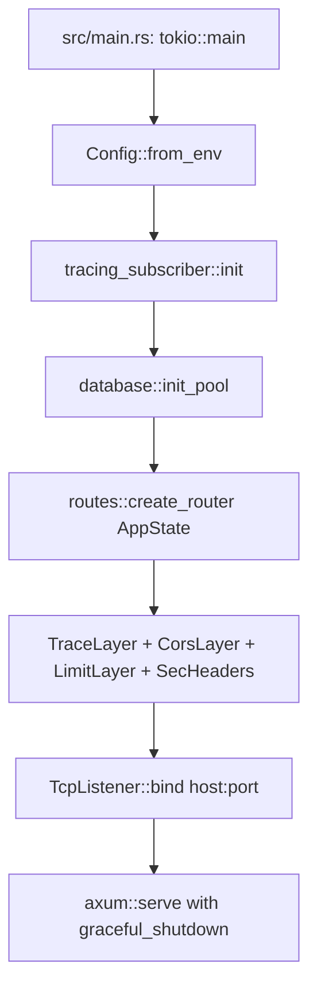

# Tarea 10: Ensamblaje Global, Enrutamiento Central y Pruebas E2E

| Atributo | Detalle |
|:---|:---|
| **ID de Tarea** | `TASK-10` |
| **Módulos Afectados** | [`src/main.rs`](file:///Users/demian/Documents/GitHub/telemetry-api/src/main.rs), [`src/routes/`](file:///Users/demian/Documents/GitHub/telemetry-api/src/routes/), [`tests/`](file:///Users/demian/Documents/GitHub/telemetry-api/tests/) |
| **Dependencias** | Todas las tareas previas ([`TASK-01`](file:///Users/demian/Documents/GitHub/telemetry-api/tasks/task-01-foundations-config-errors.md) a [`TASK-09`](file:///Users/demian/Documents/GitHub/telemetry-api/tasks/task-09-audit-logging-and-data-subject-rights.md)) |
| **Prioridad** | Crítica / P0 |

---

## 1. Contexto y Arquitectura

Esta tarea unifica todos los módulos de dominio e infraestructura en una aplicación REST monolítica completamente funcional y lista para producción:
1. **Enrutador Raíz (`src/routes/mod.rs`):** Monta todas las rutas bajo `/api/v1/` y define el endpoint público `/health`.
2. **Ciclo de Vida y Servidor (`src/main.rs`):** Inicialización de configuración, pool de base de datos, capas de middleware, enlace de socket TCP y mecanismo de parada elegante (*graceful shutdown*) respondiendo a señales SIGINT y SIGTERM.
3. **Suite Completa de Pruebas de Integración (`tests/`):** Valida los flujos de negocio completos de extremo a extremo simulando peticiones HTTP reales.



---

## 2. Requerimientos Funcionales y Endpoints

### 1. `GET /health` (Público)
- No requiere autenticación.
- Ejecuta un ping a la base de datos PostgreSQL (`SELECT 1`).
- Retorna `200 OK` con:
  ```json
  {
    "status": "healthy",
    "version": "0.1.0",
    "timestamp": "2024-01-15T10:30:00Z"
  }
  ```

### 2. Estructura del Árbol de Rutas
```text
/health                                -> Health Check
/api/v1/auth/register                  -> Registro de Admin
/api/v1/auth/login                     -> Inicio de sesión
/api/v1/auth/refresh                   -> Rotación de refresh token
/api/v1/auth/logout                    -> Revocación de refresh token
/api/v1/admins/me                      -> Perfil y actualización de Admin
/api/v1/workers                        -> CRUD y listado de Workers
/api/v1/workers/:id/consent            -> Modificación de consentimiento
/api/v1/workers/me/data-request        -> Solicitud de portabilidad DSR
/api/v1/workers/me/data-deletion       -> Solicitud de supresión DSR
/api/v1/telemetry/system               -> Ingesta y consulta de actividad del sistema
/api/v1/telemetry/network              -> Ingesta y consulta de navegación web
/api/v1/telemetry/productivity         -> Ingesta y consulta de pulsaciones y capturas
/api/v1/telemetry/files                -> Ingesta y consulta de accesos a archivos
/api/v1/telemetry/location             -> Ingesta y consulta de geolocalización (FIELD)
```

---

## 3. Arquitectura de Código y Pseudocódigo

### A. Enrutador Principal ([`src/routes/mod.rs`](file:///Users/demian/Documents/GitHub/telemetry-api/src/routes/mod.rs))

```rust
use axum::{
    extract::State,
    http::StatusCode,
    response::IntoResponse,
    routing::get,
    Json, Router,
};
use chrono::Utc;
use serde_json::json;
use crate::{
    admin, auth, database, errors::AppError, telemetry, worker, AppState,
};

pub fn create_router(state: AppState) -> Router {
    let api_v1 = Router::new()
        .nest("/auth", auth::routes::router())
        .nest("/admins", admin::routes::router())
        .nest("/workers", worker::routes::router())
        .nest("/telemetry", telemetry::routes::router());

    Router::new()
        .route("/health", get(health_check))
        .nest("/api/v1", api_v1)
        .fallback(fallback_handler)
        .with_state(state)
}

async fn health_check(State(state): State<AppState>) -> Result<impl IntoResponse, AppError> {
    database::check_health(&state.db).await?;

    Ok(Json(json!({
        "status": "healthy",
        "version": env!("CARGO_PKG_VERSION"),
        "timestamp": Utc::now()
    })))
}

async fn fallback_handler() -> impl IntoResponse {
    (
        StatusCode::NOT_FOUND,
        Json(json!({
            "error": {
                "code": "RESOURCE_NOT_FOUND",
                "message": "The requested API endpoint does not exist",
                "details": null
            }
        })),
    )
}
```

### B. Punto de Entrada y Parada Elegante ([`src/main.rs`](file:///Users/demian/Documents/GitHub/telemetry-api/src/main.rs))

```rust
use std::net::SocketAddr;
use tokio::signal;
use telemetry_api::{config::Config, database, routes::create_router, AppState};

#[tokio::main]
async fn main() -> anyhow::Result<()> {
    // 1. Cargar configuración tipada
    let config = Config::from_env()?;

    // 2. Inicializar sistema de tracing estructurado
    tracing_subscriber::fmt()
        .with_env_filter(tracing_subscriber::EnvFilter::from_default_env())
        .with_target(false)
        .compact()
        .init();

    tracing::info!("Starting Telemetry API v{}", env!("CARGO_PKG_VERSION"));

    // 3. Inicializar base de datos y migraciones
    let db_pool = database::init_pool(&config).await?;

    // 4. Construir estado global
    let state = AppState {
        config: config.clone(),
        db: db_pool,
    };

    // 5. Ensamblar router con middlewares
    let app = create_router(state)
        .layer(tower_http::limit::RequestBodyLimitLayer::new(config.max_payload_bytes));

    // 6. Enlazar socket TCP
    let addr = SocketAddr::new(config.server_host.parse()?, config.server_port);
    let listener = tokio::net::TcpListener::bind(addr).await?;
    tracing::info!("Server listening on http://{}", addr);

    // 7. Servir con Graceful Shutdown
    axum::serve(listener, app)
        .with_graceful_shutdown(shutdown_signal())
        .await?;

    tracing::info!("Telemetry API shutdown completed gracefully");
    Ok(())
}

async fn shutdown_signal() {
    let ctrl_c = async {
        signal::ctrl_c().await.expect("failed to install Ctrl+C handler");
    };

    #[cfg(unix)]
    let terminate = async {
        signal::unix::signal(signal::unix::SignalKind::terminate())
            .expect("failed to install signal handler")
            .recv()
            .await;
    };

    #[cfg(not(unix))]
    let terminate = std::future::pending::<()>();

    tokio::select! {
        _ = ctrl_c => tracing::info!("Received Ctrl+C, initiating shutdown..."),
        _ = terminate => tracing::info!("Received SIGTERM, initiating shutdown..."),
    }
}
```

---

## 4. Prácticas de Programación y Reglas de Seguridad

- **Manejo de Señales del Sistema Operativo:** Asegurar que el servidor no aborte abruptamente transacciones en vuelo cuando se detiene el contenedor o proceso; permitir el drenaje de conexiones con `graceful_shutdown`.
- **Límites de Recursos:** Enforzar estrictamente el límite de tamaño de petición mediante `RequestBodyLimitLayer`.
- **Ruta de Fallback:** Manejar peticiones a URLs inexistentes devolviendo el formato de error JSON estándar de la aplicación con código HTTP 404, en lugar del cuerpo de texto plano por defecto de Axum.

---

## 5. Validaciones y Restricciones

- Puerto de escucha: Validación temprana en `Config::from_env()`.
- Verificación de salud: El endpoint `/health` debe comprobar activamente la conectividad con PostgreSQL y responder en menos de 50 milisegundos.

---

## 6. Logs y Observabilidad

- Registrar en arranque: versión de la aplicación, dirección de socket y estado de migraciones.
- Registrar en parada: inicio del proceso de apagado y confirmación del drenaje de tareas asíncronas.

---

## 7. Criterios de Aceptación y Definición de Terminado (DoD)

1. [ ] La aplicación compila limpiamente y arranca con `cargo run`.
2. [ ] `/health` responde `200 OK` con JSON describiendo el estado.
3. [ ] El servidor responde apropiadamente a señales SIGINT/SIGTERM terminando limpiamente.
4. [ ] Suite completa de pruebas de integración en `tests/` ejecutada exitosamente con `cargo test`.
5. [ ] Cero warnings con `cargo clippy -- -D warnings`.
6. [ ] Formateo verificado con `cargo fmt --check`.

---

## 8. Especificación de Pruebas de Integración (End-to-End)

Crear en el directorio `tests/` los siguientes escenarios automatizados:
1. **`tests/auth_tests.rs`:**
   - Registro de nuevo administrador.
   - Login y recepción de Access y Refresh Token.
   - Refresco de token válido.
   - Intento de reuso del refresh token anterior esperando detección de ataque y revocación total.
2. **`tests/worker_tests.rs`:**
   - Creación de un trabajador por parte del admin.
   - Actualización de consentimientos por parte del trabajador.
   - Intento fallido de un trabajador `OFFICE` para habilitar `location`.
3. **`tests/telemetry_e2e_tests.rs`:**
   - Envío de lote de telemetría por parte del trabajador.
   - Consulta paginada del lote por parte del admin.
   - Verificación de que el contenido binario devuelto al admin coincide exactamente con el enviado por el trabajador (integridad de payload cifrado).
